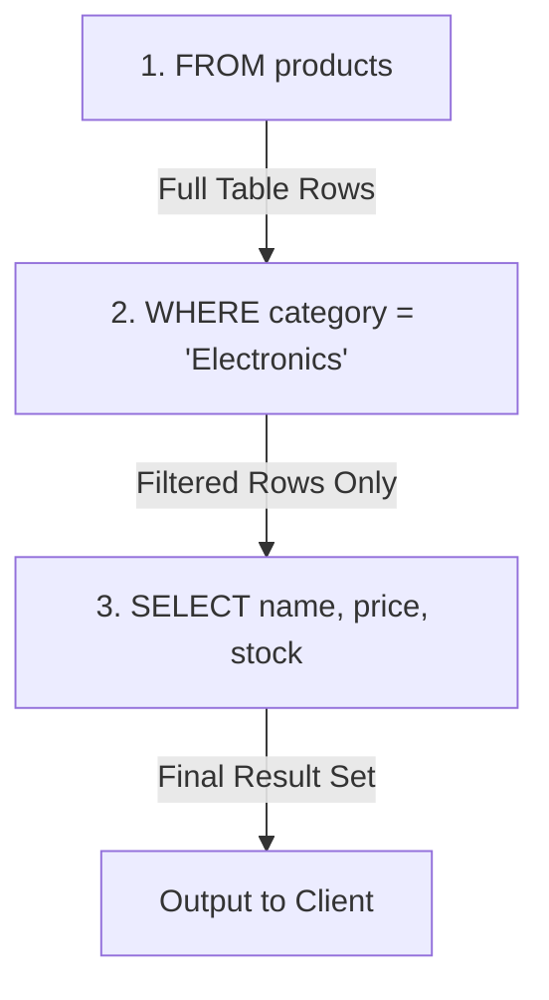

# 🔍 WHERE Clause & Basic Filtering (`05_where_basic_filter.sql`)

This script demonstrates row-level data filtering in PostgreSQL using the `WHERE` clause and comparison operators.

---

## 📌 1. Core Syntax & Mental Model

```sql
-- Filter by categorical text match (Exact Match)
SELECT name, price, stock
FROM products
WHERE category = 'Electronics';

-- Filter by numerical range comparison
SELECT name, price
FROM products
WHERE price > 1000;
```

### 🧠 SQL Query Execution Order (Logical Processing)
SQL does not execute top-to-bottom like procedural code. It processes in a distinct logical order:

1. **`FROM`**: Identifies and loads the target table (`products`).
2. **`WHERE`**: Filters rows one-by-one against predicate conditions. Only rows evaluating to `TRUE` survive.
3. **`SELECT`**: Extracts and computes only the requested columns (`name`, `price`, `stock`).



---

## ⚙️ 2. Comparison Operators Reference

| Operator | Meaning | Example |
| :--- | :--- | :--- |
| `=` | Equal to | `WHERE category = 'Electronics'` |
| `<>` or `!=` | Not equal to | `WHERE category <> 'Audio'` |
| `>` / `<` | Greater than / Less than | `WHERE price > 1000` |
| `>=` / `<=` | Greater than or equal / Less than or equal | `WHERE stock >= 50` |

> [!NOTE]
> String literals in SQL must always be wrapped in **single quotes** (`'Electronics'`). Double quotes (`"name"`) are reserved for table and column identifiers.

---

## 💼 3. Top Interview Questions

### ❓ Q1: Why can't you use a column alias defined in the `SELECT` clause inside the `WHERE` clause?
* **Answer:** Because the **`WHERE` clause is evaluated before the `SELECT` clause** in SQL logical query processing. When the engine executes `WHERE`, the alias created in `SELECT` does not exist yet.
  ```sql
  -- ❌ FAILS: "column discounted_price does not exist"
  SELECT name, price * 0.90 AS discounted_price
  FROM products
  WHERE discounted_price > 500;

  -- ✅ CORRECT: Repeat expression or use a CTE / Subquery
  SELECT name, price * 0.90 AS discounted_price
  FROM products
  WHERE (price * 0.90) > 500;
  ```

---

### ❓ Q2: What is Three-Valued Logic (3VL), and why does `WHERE stock = NULL` return 0 rows?
* **Answer:** SQL uses **Three-Valued Logic**: expressions evaluate to `TRUE`, `FALSE`, or `NULL` (UNKNOWN). `NULL` represents missing or unknown data, so comparing anything to `NULL` using `=` produces `NULL` (UNKNOWN), not `TRUE`. The `WHERE` clause only returns rows where the condition is explicitly `TRUE`.
  * **Incorrect**: `WHERE stock = NULL` (always returns nothing)
  * **Correct**: `WHERE stock IS NULL` or `WHERE stock IS NOT NULL`

---

### ❓ Q3: How does the `WHERE` clause affect database performance and indexing?
* **Answer:**
  * Without an index on the filtered column, PostgreSQL performs a **Sequential Scan (`Seq Scan`)**, reading every row on disk.
  * With a B-Tree index (e.g., `CREATE INDEX ON products(category)`), PostgreSQL uses an **Index Scan** or **Bitmap Index Scan**, jumping directly to matching rows in $O(\log N)$ time.
  * **SARGability rule**: Applying functions to columns in `WHERE` (e.g., `WHERE LOWER(category) = 'electronics'`) invalidates regular indexes unless an expression index is explicitly created.
