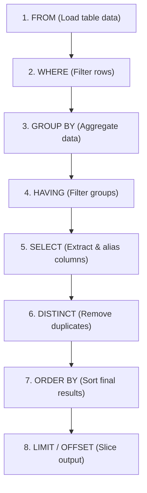

# 📶 Sorting Query Results: ORDER BY (`10_order_by.sql`)

This guide covers sorting and ordering query results in PostgreSQL using the `ORDER BY` clause, ascending/descending modifiers, multi-column tie-breaking, `NULL` ordering rules, and sorting performance optimization.

---

## 📌 1. What is `ORDER BY`?

In relational database theory, a database table is an **unordered mathematical set** of rows.

> [!IMPORTANT]
> **Without an explicit `ORDER BY` clause, PostgreSQL makes NO guarantee about the order in which rows are returned.**
> Even if rows appear in insertion order today, operations like updates, deletions, table vacuums, or parallel scans will alter the physical retrieval order. `ORDER BY` is the **only** way to guarantee deterministic sorting.

---

## 🔑 2. Sorting Directions: ASC vs DESC

| Modifier | Meaning | Numbers | Text | Dates / Timestamps | Default? |
| :--- | :--- | :--- | :--- | :--- | :--- |
| **`ASC`** | **Ascending** | Smallest $\rightarrow$ Largest (`1` $\rightarrow$ `100`) | A $\rightarrow$ Z | Oldest $\rightarrow$ Newest | **Yes** (Default) |
| **`DESC`** | **Descending** | Largest $\rightarrow$ Smallest (`100` $\rightarrow$ `1`) | Z $\rightarrow$ A | Newest $\rightarrow$ Oldest | No |

---

## 💻 3. Code Walkthrough (`10_order_by.sql`)

### Query 1: Single-Column Ascending Sort (`ASC`)
```sql
SELECT name, price
FROM products
ORDER BY price ASC;
```
* **Behavior**: Sorts products from the cheapest to the most expensive.
* **Output Sample**:
  1. `H&M Slim Fit Cotton Shirt` (\$29.99)
  2. `Zara Floral Summer Dress` (\$59.90)
  ...
  16. `Samsung Galaxy S24 Ultra` (\$1199.99)

---

### Query 2: Single-Column Descending Sort (`DESC`)
```sql
SELECT name, price
FROM products
ORDER BY price DESC;
```
* **Behavior**: Sorts products from the most expensive (flagship) down to the cheapest.
* **Output Sample**:
  1. `Samsung Galaxy S24 Ultra` (\$1199.99)
  2. `Apple MacBook Air M3` (\$1099.00)
  ...
  16. `H&M Slim Fit Cotton Shirt` (\$29.99)

---

### Query 3: Multi-Column Sorting & Tie-Breaking
```sql
SELECT name, category, price
FROM products
ORDER BY category DESC, price ASC;
```
* **Behavior**:
  1. **Primary Sort**: Sorts all rows by `category` in descending alphabetical order (`Home Appliances` $\rightarrow$ `Gaming` $\rightarrow$ `Footwear` $\rightarrow$ `Electronics` $\rightarrow$ `Computers` $\rightarrow$ `Clothing` $\rightarrow$ `Audio` $\rightarrow$ `Accessories`).
  2. **Secondary Sort (Tie-Breaker)**: Whenever multiple products share the **same category**, it sorts those specific products by `price` ascending (cheapest to most expensive).

#### Result Breakdown:
```text
Category: Footwear (DESC)
  ├── Nike Air Force 1 '07      ($115.00) [Cheaper first]
  └── Adidas Ultraboost Light   ($189.99)

Category: Electronics (DESC)
  ├── Apple Watch Series 9      ($399.00) [Cheapest first]
  ├── iPhone 15 Pro             ($999.99)
  └── Samsung Galaxy S24 Ultra  ($1199.99) [Most expensive last]
```

---

## 🧠 4. Logical Query Processing Order

Unlike procedural languages, SQL executes clauses in a specific logical sequence:



> [!NOTE]
> Because **`ORDER BY` runs after `SELECT`**, you **can** sort by column aliases defined in `SELECT`:
> ```sql
> SELECT name, price * 0.90 AS sale_price
> FROM products
> ORDER BY sale_price DESC; -- ✅ Valid in ORDER BY (Invalid in WHERE)
> ```

---

## ⚖️ 5. NULL Handling in Sorting (`NULLS FIRST` / `NULLS LAST`)

By default, PostgreSQL considers `NULL` to be "larger" than any non-null value:

| Sort Clause | Default `NULL` Placement | Explicit Override Syntax |
| :--- | :--- | :--- |
| **`ORDER BY col ASC`** | **`NULLS LAST`** (At the end) | `ORDER BY col ASC NULLS FIRST` |
| **`ORDER BY col DESC`**| **`NULLS FIRST`** (At the beginning) | `ORDER BY col DESC NULLS LAST` |

### Example:
```sql
-- Force missing descriptions to appear at the very bottom even with DESC sort
SELECT name, description, price
FROM products
ORDER BY description DESC NULLS LAST;
```

---

## 💼 6. Top Interview Questions

### ❓ Q1: Why does a query without `ORDER BY` return rows in an unpredictable order?
* **Answer:**
  * Relational algebra defines tables as **unordered sets**.
  * The physical order of rows on disk (the "heap") changes whenever rows are updated (PostgreSQL uses MVCC, creating a new row version at the end of the page or table) or deleted (vacuums leave free space for future inserts).
  * Parallel query workers and different join algorithms also emit rows in arbitrary order. **Only `ORDER BY` guarantees deterministic order.**

---

### ❓ Q2: Can you sort by a column that is NOT included in the `SELECT` clause? What happens if `DISTINCT` is used?
* **Answer:**
  * **Normal Queries**: **Yes**, you can sort by any column present in the source table even if it is not selected:
    ```sql
    SELECT name FROM products ORDER BY created_at DESC; -- ✅ Valid
    ```
  * **With `SELECT DISTINCT`**: **No**. If `DISTINCT` is used, every column in `ORDER BY` **must** appear in the `SELECT` list:
    ```sql
    -- ❌ ERROR: for SELECT DISTINCT, ORDER BY expressions must appear in select list
    SELECT DISTINCT category FROM products ORDER BY price;

    -- ✅ FIX: Include column in SELECT list
    SELECT DISTINCT category, price FROM products ORDER BY price;
    ```

---

### ❓ Q3: How does PostgreSQL execute sorting internally, and what happens when sorting large datasets?
* **Answer:**
  * **In-Memory Sort (`quicksort` / `top-N heapsort`)**: If the dataset fits inside PostgreSQL's allocated **`work_mem`** buffer (default 4MB), the sort completes in memory.
  * **Disk-Spill Sort (`external merge Disk`)**: If the dataset exceeds `work_mem`, PostgreSQL writes temporary sort batches to disk and merges them, which is significantly slower.
  * **Index Elimination**: If a matching **B-Tree index** exists (e.g., `CREATE INDEX ON products(category DESC, price ASC)`), PostgreSQL skips sorting entirely and simply reads rows directly off the index in pre-sorted order!
